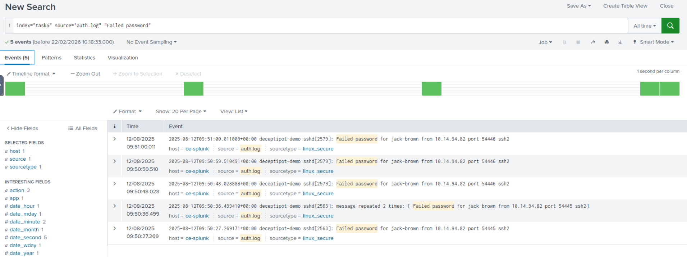
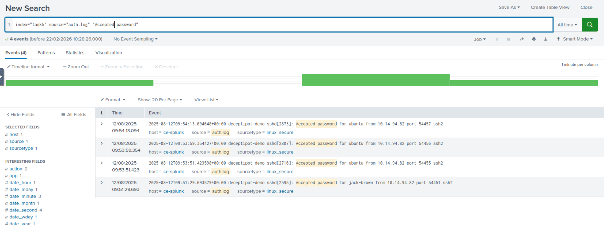
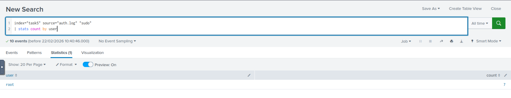
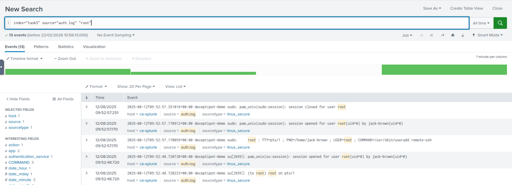
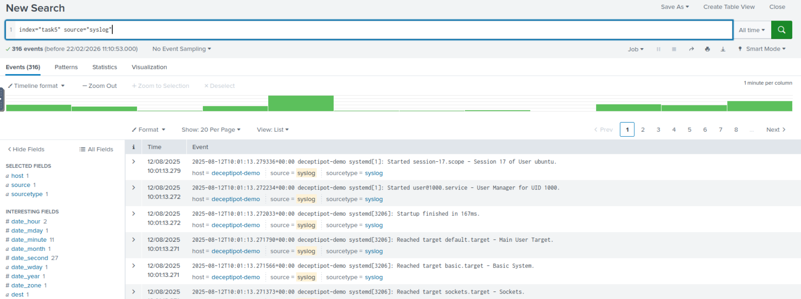
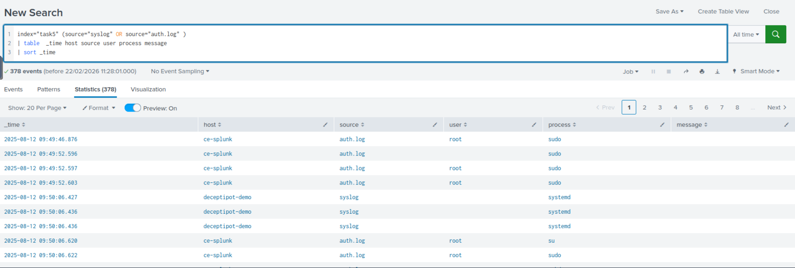

##  Detection Queries Used

### 1 Failed SSH Login Detection

```sql
index="task5" source="auth.log" "Failed password"
```

**Purpose:**

- Detect brute force attempts

- Identify suspicious IP activity



The logs indicate a suspected SSH brute-force attack targeting user jack-brown from IP 10.14.94.82.

No successful login observed in current dataset, but continuous monitoring is required.


---

### 2 Successful SSH Login Monitoring

```sql
index="task5" source="auth.log" "Accepted password"
```

**Purpose:**

- Monitor valid authentication events

- Detect possible compromise after failures



The attack pattern shows a brute force attempt followed by successful SSH authentication from the same IP address.

This confirms a credential compromise and unauthorized remote access.

Immediate containment and further forensic investigation are required.

---

### 3 Privilege Escalation Monitoring

```sql
index="task5" source="auth.log" "sudo"
| stats count by user
```

**Purpose:**

- Identify abnormal sudo activity



**What This Means**

- The keyword "sudo" was found in auth.log

- There were 7 sudo-related events

- All events are associated with the root user

 **Important Interpretation**

In Linux logs, sudo activity usually appears when:

- A normal user runs sudo <command>

- The action is logged in /var/log/auth.log

- It may show:

    - Which user executed sudo

    - Which command was executed

    - Whether it succeeded or failed

However:

If your stats show only root, it could mean:

1 Root user executed commands directly

2 Logs are recording actions as root

3 Field extraction may not be parsing the invoking user correctly

 **Why This Is Important (After SSH Compromise)**

Earlier you detected:

- Failed SSH attempts

- Successful SSH login from attacker IP

- Access to multiple accounts

Now if sudo activity appears after successful login, this suggests:

 **Possible Privilege Escalation**

The attacker may have:

- Logged in as a normal user

- Used sudo to gain root privileges

- Executed administrative commands

---

### 4 Root Login Monitoring

```sql
index="task5" source="auth.log" "root"
```
**Purpose:**

- Detect direct root authentication attempts



**Attack Chain**

1 Initial Access

- Brute force attempts from IP: 10.14.94.82

2 Credential Compromise

- Successful login:

  - Accepted password

3 Privilege Escalation
- session opened for user root

4 Persistence Established
- useradd remote-ssh

" This confirms attacker created a backdoor account."

**Conclusion**

This is a confirmed multi-stage attack:

- Brute force

- Successful SSH login

- Root privilege escalation

- New user creation (persistence)

Severity Level:  CRITICAL INCIDENT

--- 

### 5 System Activity Monitoring

```sql
index="task5" source="syslog"
```


**Purpose:**

- Review service startup and session activity

- Detect abnormal system behavior

 **What These Logs Mean**

These are systemd service and session logs.

They indicate:

- A user session was started

- System services were initialized

- User manager process was created

- System targets were reached

This is normal system activity during:

- User login

- Service startup

- Session creation

- System boot or restart

 **Important Context (After SSH Compromise)**

Earlier, you confirmed:

1 SSH brute force

2 Successful login

3 Root privilege escalation

4 New user creation

Now, syslog can help confirm:

- When sessions started

- Which user logged in

- Whether system services were restarted

- If attacker rebooted the system

---

### 6  To see full attack chain across logs:

```sql
index="task5" (source="syslog" OR source="auth.log" ) 
| table  _time host source user process message 
| sort _time
```


This will show:

- SSH login

- Sudo escalation

- User creation

- Session start

- Service modifications

In one timeline.


