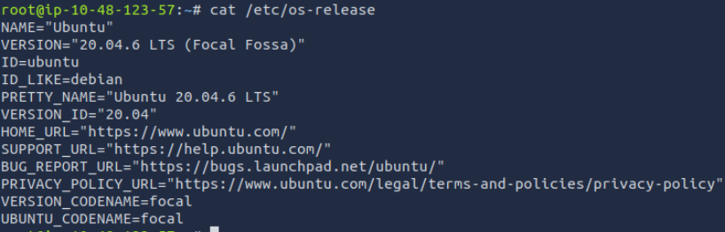
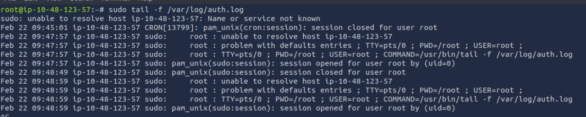
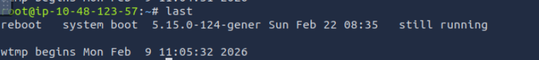
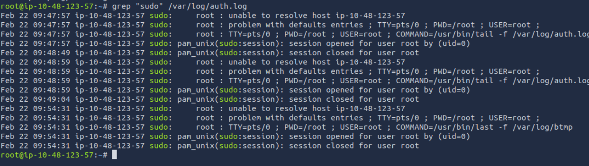
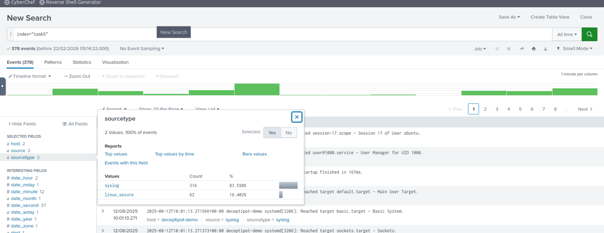

#  Linux Log Analysis Report  
**Project Type:** SOC Level 1 – Linux Log Monitoring using Splunk  
**Analyst:** Anubhav Kumar  
**Platform:** Splunk Enterprise (TryHackMe Lab)  
**Index Analyzed:** tasks5 
**Log Sources:** syslog, auth.log  
**Total Events Reviewed:** 378  

---

#  1. Executive Summary

This project focuses on analyzing Linux authentication and system logs using both:

- Linux terminal commands (manual verification)
- Splunk (centralized log analysis)

The objective was to detect suspicious authentication attempts, monitor privilege escalation, and analyze system activity for potential threats.

During analysis:

- 316 events originated from `syslog`
- 62 events originated from `auth.log`

No critical compromise was identified during the observed timeframe; however, authentication and system monitoring capabilities were successfully demonstrated.

---

#  2. Log Sources Overview

## 🔹 2.1 /var/log/auth.log

Authentication log containing:

- SSH login attempts (success & failed)
- Invalid user attempts
- Root login attempts
- sudo activity
- PAM authentication failures

## 🔹 2.2 /var/log/syslog

System activity log containing:

- System startup events
- Service status changes
- User session creation
- systemd activity
- Background process logs

---

#  3. Terminal-Based Log Verification

Before analyzing logs in Splunk, log sources were verified directly on the Linux system.

---

##  3.1 Identify Linux Distribution

```bash 
cat /etc/os-release
```
**Purpose:**

- Confirm OS type (Debian/Ubuntu vs RHEL-based)




## 3.2 Verify Authentication Log Exists

```bash 
ls -lh /var/log/auth.log
```
**Purpose:**

- Confirm log file availability and size


## 3.3 Monitor Authentication Logs in Real-Time

```bash 
sudo tail -f /var/log/auth.log 
```
Purpose:

- Observe live SSH login attempts

- Identify failed password attempts



## 3.4 Check Successful Login History

**Purpose:**

- Identify successful login sessions

```bash 
last
```


## 3.5 Check Sudo Usage

**Purpose:**

- Detect privilege escalation attemp

```bash 
grep "sudo" /var/log/auth.log
```



## 3.6 Review System Logs

**Purpose:**

- Monitor service activity and system events

---

4. Splunk Log Analysis

- After verifying logs locally, events were analyzed in Splunk using:

```spl
index="tasks"
```


**Log source breakdown:**

- syslog → 316 events (83.59%)

- auth.log → 62 events (16.40%)

---

