# Phishing Email Investigation Report 


 **Case ID:** 001 

- **Date of Investigation:** 2026-02-18

- **Analyst Name:** Anubhav Kumar 

- **Email File Name:** email-01-tech-support-scam.eml

- **Investigation Type:** Email Phishing Analysis 

---

## Email Metadata Summary 

## Tool Used

**Operating System:** Kali Linux  
**Utility:** grep (Linux Command-Line Tool)

## Command Used


1  This command filters important metadata such as Subject, Date, Sender, Recipient, Reply-To, Return-Path, and Message-ID for forensic analysis.

```bash
grep -E "Subject:|Date:|From:|To:|Cc:|Bcc:|Reply-To:|Return-Path:|Message-ID:" email-file.eml
```

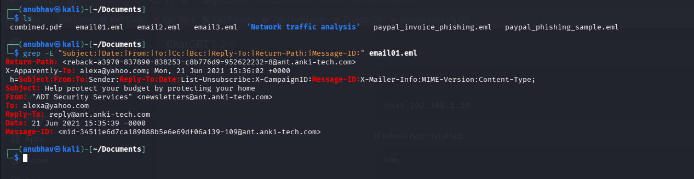

2  This command helps identify the email routing path and determine the originating (sender) IP address by analyzing the bottom-most "Received" entry.

```bash
grep "^Received:" email01.eml
```

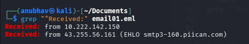


| Field | Details | 
|--------|----------| 
| Email Subject Line | Help protect your budget by protecting your home | 
| Date / Time | 21 Jun 2021 15:35:39 -0000 | 
| Sender Email Address | newsletters@ant.anki-tech.com | 
| Sender IP Address | 43.255.56.161 | 
| Recipient Email Address | alexa@yahoo.com | 
| Reply-To Email Address | reply@ant.anki-tech.com | 
| Return-Path | <reback-a3970-837890-838253-c8b776d9=952622232=8@ant.anki-tech.com> | 
| Message-ID | <mid-34511e6d7ca189088b5e6e69df06a139-109@ant.anki-tech.com> | 

---

## Reverse Lookup of Sender IP

The sender IP address (43.255.56.161) was analyzed using an online WHOIS lookup service.

### Tool Used
DomainTools (Online WHOIS Lookup)

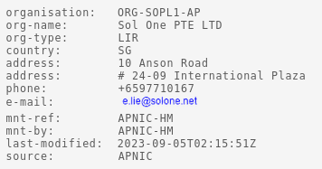
                 OR
command:
```bash
whois 43.255.56.161                
``` 
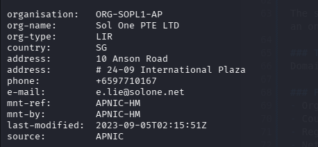


### Findings
- Organization: Sol One PTE LTD
- Country: Singapore (SG)
- Registry: APNIC
- Network Range: 43.255.56.0 - 43.255.59.255

### Analysis
The IP address is associated with a hosting/network service provider in Singapore. 
This suggests that the email was likely sent through third-party infrastructure rather than a residential ISP.

--- 

## CC / BCC Extraction

The following command was used to check for additional recipients:

```bash
grep -E "^Cc:|^Bcc:" email01.eml
```

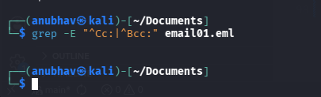

---


## SPF Record Verification

The sender domain was checked for an SPF record using DNS lookup in a Linux environment.

### Command Used

```bash
dig txt ant.anki-tech.com
```
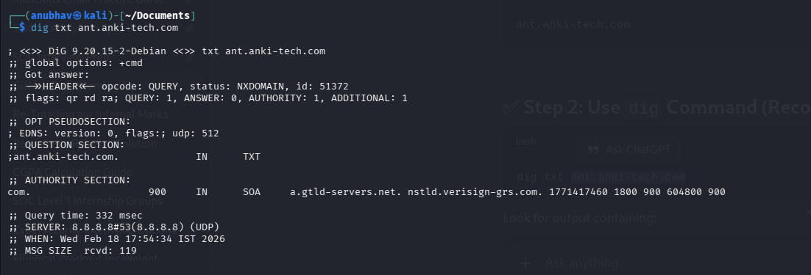

**Result**

No SPF record (v=spf1) was found in the DNS TXT records.
Analysis

The absence of an SPF record indicates that the domain does not implement SPF authentication.
This weakens email security controls and increases the risk of domain spoofing.

---

## DKIM Record Analysis


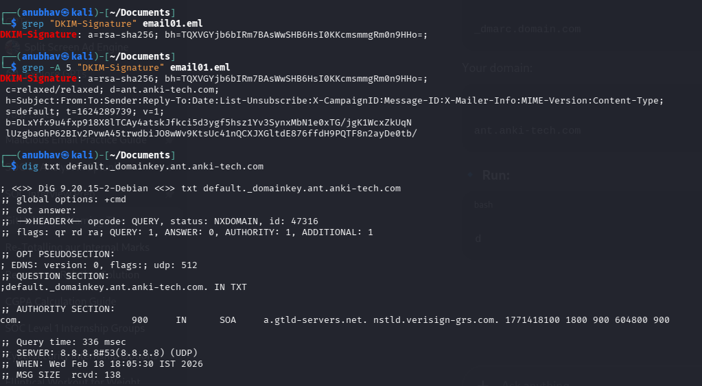

### Command Used

```bash
grep -A 5 "DKIM-Signature" email01.eml
dig txt default._domainkey.ant.anki-tech.com
```

**Result**

The DNS query returned NXDOMAIN, indicating that no DKIM public key record exists for the specified selector.
Analysis

The absence of a DKIM public key suggests that DKIM is not properly configured for the domain.
This weakens email authentication and increases the risk of email spoofing.

---

## DMARC Record Analysis

The DMARC record for the sender domain was checked using DNS lookup.

### Command Used

```bash
dig txt _dmarc.ant.anki-tech.com
```


**Result**

The DNS query returned NXDOMAIN, indicating that no DMARC record exists for the domain.

**Analysis**

The absence of a DMARC policy means the domain does not enforce SPF or DKIM validation.
This significantly weakens email authentication and increases the risk of domain spoofing and phishing attacks.

---

## 3 Sender Analysis 

## External Sender Domain 

- Is sender domain external? Yes 

- **Domain Reputation:** 
0 security vendors flagged the domain as malicious at the time of analysis.

The sender domain was analyzed using VirusTotal.


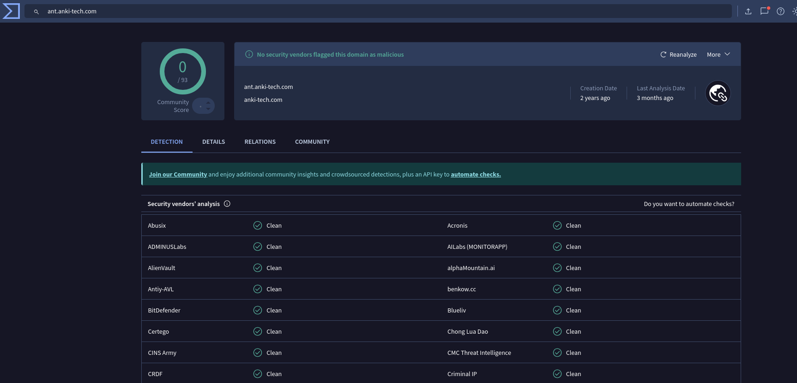


Analysis
Although no detections were observed, the absence of alerts does not guarantee legitimacy. 
Newly registered domains or low-volume phishing campaigns may not yet be flagged by threat intelligence platforms.

-  **Domain Age:** 2023-05-25 00:00:00 UTC 


Analysis
A domain age of 2 years indicates it is not newly registered. 
However, domain age alone does not confirm legitimacy, as compromised or previously inactive domains can be used in phishing campaigns.

- **Registrar:** dynadot

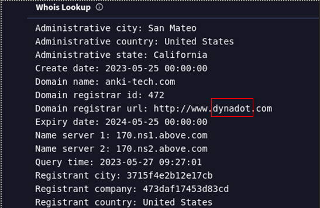

  - Observation

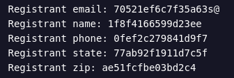

    - These look anonymized / privacy-protected details.
    - Indicates WHOIS privacy protection enabled.

That is common for:

Marketing domains

Sometimes phishing domains

---

## Impersonation Analysis


The email claims to originate from "ADT Security Services" in the display name.

### Observations

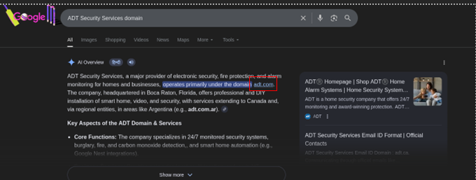

- Display Name: ADT Security Services
- Sender Domain: ant.anki-tech.com
- Official Brand Domain: adt.com

**Analysis**

The sender domain does not match the official domain of the claimed organization. 
This indicates a potential brand impersonation attempt, where the attacker uses a trusted company name to gain credibility.

Such impersonation is a common phishing technique used to deceive recipients.

---

## Side Channel Communication Attempt

- Phone Number Included: 1-844-674-3380

**Analysis**

The presence of a support phone number suggests a potential tech support scam or call-based phishing attempt rather than a credential harvesting campaign.

---

 ## URL Analysis

 - Extract All URLs from Email

 ```bash
grep -Eo 'http[s]?://[^"]+' email01.eml
```

 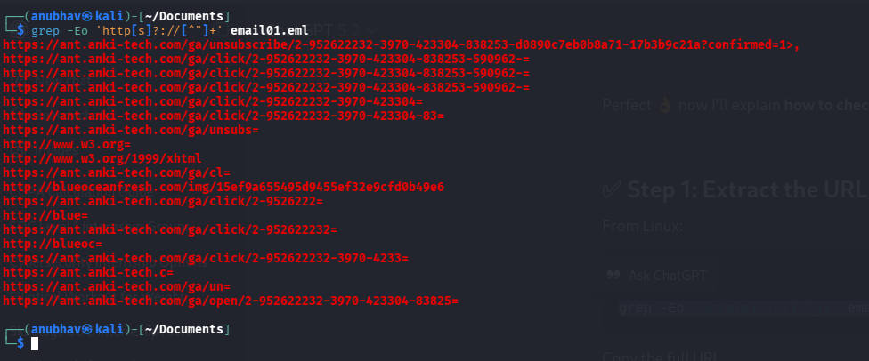

- Extract Unique Domains

```bash
grep -Eo 'http[s]?://[^"]+' email01.eml | cut -d/ -f3 | sort -u
```

- Domains Identified

     - ant.anki-tech.com  
     - blueoceanfresh.com  
     - www.w3.org  

- Filter Non-Relevant URLs

   - **www.w3.org** → Standard HTML reference (Not suspicious)  
    - Tracking URLs (`/ga/open/`, `/ga/click/`, `/unsubscribe/`) → Marketing tracking infrastructure 

- Identify External or Suspicious Domains

   - **blueoceanfresh.com** → External domain (different from sender domain)

The external domain was analyzed using VirusTotal.

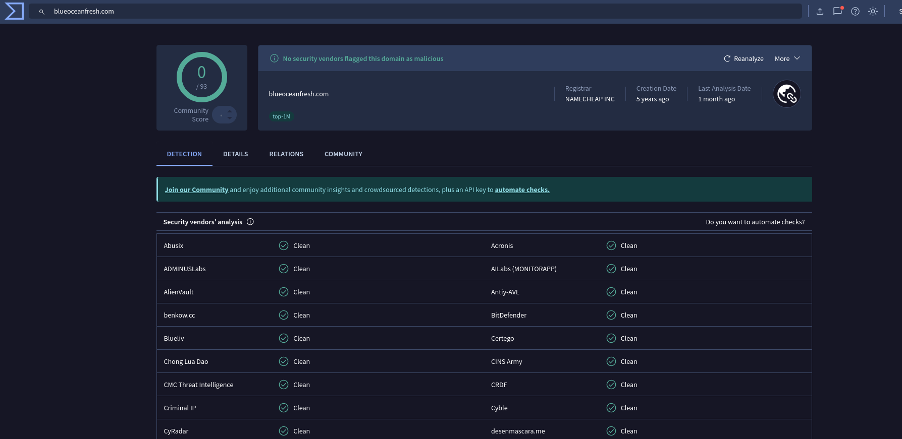

0 security vendors flagged the domain as malicious at the time of analysis.

**Final URL Analysis Conclusion**

Most extracted URLs were tracking links associated with the sender domain.  
One external domain was identified and analyzed.

No direct credential harvesting or malicious download link was observed.  
However, the presence of tracking infrastructure and external resources indicates bulk email campaign behavior.

---

 **Attachment Analysis**

The email was analyzed for file attachments using the following command:

```bash
munpack email01.eml
```

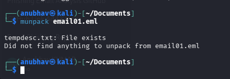

**Result**

No attachments were found in the email.

**Analysis**
The phishing attempt does not rely on file-based malware delivery.
Instead, the attack appears to use social engineering techniques and external links/phone communication.

---


## MITRE ATT&CK Mapping

### Tactic: Initial Access
- **T1566 – Phishing**

### Tactic: Defense Evasion
- **T1656 – Impersonation**

### Tactic: Command and Control
- **T1071 – Application Layer Protocol (HTTP/HTTPS)**

### Summary

The observed behavior aligns primarily with MITRE ATT&CK technique T1566 (Phishing) utilizing brand impersonation and call-based social engineering tactics.

---

## Risk Assessment

| Category | Assessment |
|-----------|-------------|
| Authentication Security | Weak |
| Domain Reputation | Clean (0 detections) |
| Infrastructure Trust | Suspicious |
| Brand Impersonation | Confirmed |
| Attachment-Based Threat | Not Present |
| Overall Risk Level | **Medium–High** |

---

## Final Verdict

Based on technical analysis, infrastructure review, authentication failures, and brand impersonation indicators:

**This email is classified as:**

☑ Phishing  
☑ Brand Impersonation  
☑ Tech Support / Call-Based Scam  

The email does not contain malware attachments but demonstrates social engineering characteristics consistent with phishing campaigns.

---

## Recommendations

- Do not interact with the sender.
- Do not call the provided phone number.
- Block sender domain and IP address.
- Report domain to hosting provider.
- Educate users regarding brand impersonation attacks.

---

## Case Closure

This investigation has been completed based on available forensic evidence and technical analysis conducted on 2026-02-18.

All relevant indicators have been documented.

**Case Status: Closed**  
**End of Report**
