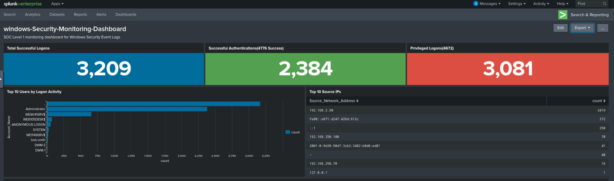
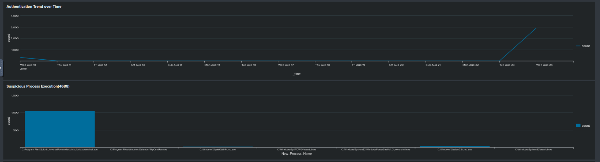

#  Windows Security Monitoring Dashboard – SOC Level 1

##  Project Overview

This project demonstrates a fully functional **SOC Level 1 Security Monitoring Dashboard** built in Splunk using the `botsv1` dataset.

The dashboard provides visibility into:

- Authentication Monitoring
- Privileged Account Activity
- Suspicious Process Execution
- User Logon Analysis
- Source IP Monitoring
- Sensitive Object Access

This simulates real-world SOC analyst responsibilities.

---

#  Data Source

**Index:** `botsv1`  
**Log Source:** `WinEventLog:Security`  
**Web Logs:** `stream:http`

---

#  1 Total Successful Logons (4624)

```spl
index=botsv1 source="WinEventLog:Security" EventCode=4624
| stats count as Total_Logons
```

**Visualization:** Single Value (Blue)  
 **Purpose:** Monitor total successful authentication events.

---

#  2 Successful Authentications (4776)

```spl
index=botsv1 source="WinEventLog:Security" EventCode=4776
| stats count as Successful_Auth
```

 **Visualization:** Single Value (Green)  
 **Purpose:** Track NTLM authentication attempts.

---

# 3 Privileged Logons (4672)

```spl
index=botsv1 source="WinEventLog:Security" EventCode=4672
| stats count as Privileged_Logons
```

 **Visualization:** Single Value (Red)  
 **Purpose:** Detect administrative privilege usage.

---

#  4 Top 10 Users by Logon Activity

```spl
index="botsv1" source="wineventlog:security" EventCode=4624
| stats count by Account_Name
| sort - count
| head 10
```

 **Visualization:** Horizontal Bar Chart  
 **Purpose:** Identify high-volume authentication accounts.

**Helps detect:**
- Compromised accounts
- Service account misuse
- Brute force success

---

#  5 Top 10 Source IP Addresses

```spl
index="botsv1" source="wineventlog:security" EventCode=4624
| stats count by Source_Network_Address
| sort - count
| head 10
```

 **Visualization:** Table  
 **Purpose:** Identify most active source IP addresses.

 Useful for:
- Brute force detection
- Lateral movement tracking
- Suspicious remote access

---

# 6 Authentication Trend Over Time

```spl
index=botsv1 source="WinEventLog:Security" EventCode=4624
| timechart count
```

 **Visualization:** Line Chart  
 **Purpose:** Detect authentication spikes.

 Helps identify:
- Password spraying
- Automated attacks
- Mass login attempts

---

#  7 Suspicious Process Execution (4688)

```spl
index=botsv1 source="WinEventLog:Security" EventCode=4688
| search New_Process_Name="*powershell*" OR New_Process_Name="*cmd.exe*" OR New_Process_Name="*wscript*"
| stats count by New_Process_Name
```

 **Visualization:** Column Chart  
 **Purpose:** Detect suspicious command-line activity.

 Common abuse tools:
- PowerShell
- CMD
- WScript

---

#  8 Sensitive Object Access (4656)

```spl
index=botsv1 source="WinEventLog:Security" EventCode=4656
| search Object_Name="*SAM*" OR Object_Name="*NTDS*" OR Object_Name="*lsass*"
| stats count by Object_Name
```

 **Visualization:** Bar Chart  
 **Purpose:** Detect access to sensitive system objects.

 Critical objects:
- SAM database
- NTDS.dit
- LSASS process

---

#  Detection Coverage

This dashboard covers:

- ✅ Valid Account Abuse (T1078)
- ✅ Privilege Escalation
- ✅ Credential Access
- ✅ Suspicious Process Execution
- ✅ Lateral Movement Indicators
- ✅ Brute Force Indicators

---

#  Skills Demonstrated

- SPL Query Writing
- EventCode Analysis
- Log Investigation
- SOC Monitoring Design
- Data Visualization in Splunk
- Security Use Case Development

---

# Dashboard Screenshots

Dashboard screenshots stored in:





---

#  Conclusion

This project demonstrates hands-on SOC Level 1 capabilities including:

- Monitoring authentication behavior
- Detecting privilege misuse
- Identifying suspicious execution
- Investigating potential credential access
- Visualizing security events effectively

It simulates real-world enterprise monitoring workflows using Splunk.

---

👨‍💻 Created as part of a SOC Level 1 Threat Detection Portfolio