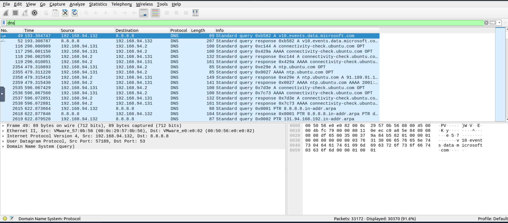
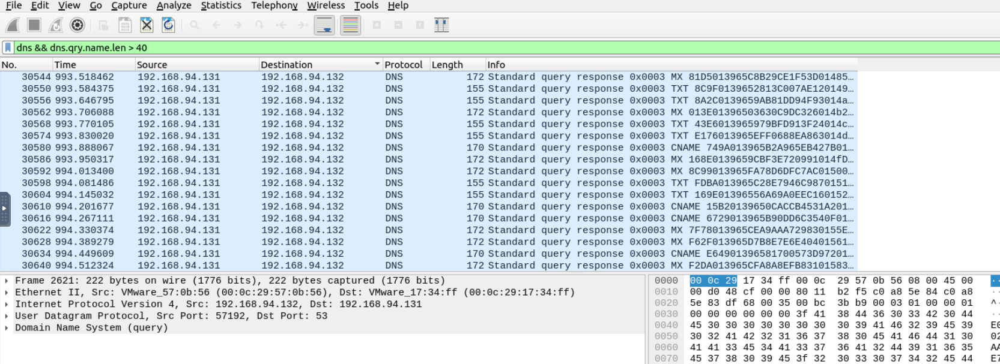
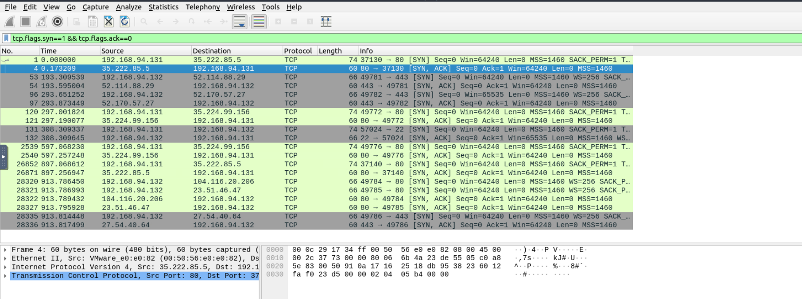
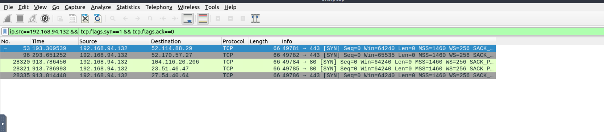
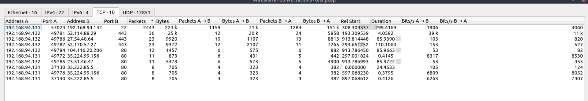
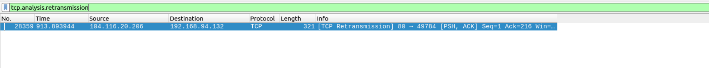
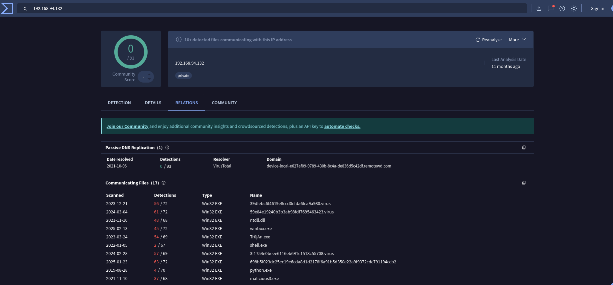

# 🛡️ Suspicious Traffic Investigation Report

## Project Title
**Suspicious DNS Traffic Analysis and Potential Covert Communication Investigation**

## Analyst Information
- **Name:** Anubhav Kumar
- **Role:** SOC Analyst 
- **Date of Investigation:** 01-03-2026
- **Platform:** TryHackMe Labs

---

## 1. Executive Summary

This report presents the analysis of network traffic captured in the 
`dns.pcap` file to identify suspicious activity and potential covert 
communication mechanisms.

During the investigation, anomalous DNS behavior was observed from the 
internal host (192.168.94.132). The traffic included a high volume of 
TXT record queries, elevated NXDOMAIN responses (16.62%), and long, 
high-entropy subdomain patterns. These characteristics deviate from 
normal user-driven DNS activity and are commonly associated with 
DNS-based tunneling or command-and-control (C2) techniques.

TCP traffic analysis did not reveal evidence of port scanning, abnormal 
connection attempts, or communication over suspicious ports. All external 
connections were directed toward legitimate cloud infrastructure over 
standard web service ports (80 and 443). Reputation checks confirmed 
no known malicious detections for the observed external IP addresses.

While no confirmed compromise was identified, the DNS anomalies indicate 
potential covert communication activity and warrant further monitoring 
and forensic validation.

---

## 2. Objective

- Analyze captured network traffic
- Identify suspicious DNS activity
- Detect repeated outbound connections
- Investigate malicious IP reputation
- Document Indicators of Compromise (IOCs)

---

## 3. Lab Environment

### Platform
TryHackMe

### Tools Used
- Wireshark
- VirusTotal


### Rooms Completed

- Wireshark: Traffic Analysis

---
###  Scope of Investigation
- **PCAP File:** dns.pcap
- **Capture Duration:** 
  - **First Packet Timestamp:** 30 June 2020, 08:24:55  
  - **Last Packet Timestamp:** 26 February 2022, 16:34:34  
  - **Total Capture Duration:** 606 days, 08 hours, 09 minutes, and 39 seconds 

-  **Total Packets Captured:** 30370
- **Internal IP Address:** 192.168.94.132
- **External IP Address:** 8.8.8.8
---

## 5. Investigation Methodology

### 5.1 DNS Traffic Analysis


**Wireshark Filter Used:**
```sql
dns 
```


###  Scope of Investigation
- **PCAP File:** dns.pcap
- **Capture Duration:** 
  - **First Packet Timestamp:** 30 June 2020, 08:24:55  
  - **Last Packet Timestamp:** 26 February 2022, 16:34:34  
  - **Total Capture Duration:** 606 days, 08 hours, 09 minutes, and 39 seconds 

-  **Total Packets Captured:** 30370
- **Internal IP Address:** 192.168.94.132
- **External IP Address:** 8.8.8.8


### Suspicious DNS Query Patterns Identified

**Wireshark Filter Used:**
```sql
dns && dns.qry.name.len > 40
```



During DNS traffic analysis, multiple queries containing long, high-entropy 
subdomains were observed. These queries included record types such as TXT, 
MX, and CNAME and contained seemingly encoded hexadecimal-like strings 
(e.g., 86BB01B0DEE7A7C6B5EB3110753B8000C9).

Characteristics observed:

- Repeated DNS queries with long random subdomains
- High-entropy alphanumeric strings
- Multiple TXT record lookups
- Consistent query structure across requests
- Queries originating from internal host 192.168.94.132

Such behavior deviates from typical user-generated DNS activity.

###  DNS Query Type Distribution

The analysis of DNS query types revealed the following distribution:

| Query Type | Count  | Percentage |
|------------|--------|------------|
| PTR        | 20,192 | 66.49%     |
| MX         | 3,502  | 11.53%     |
| TXT        | 3,344  | 11.01%     |
| CNAME      | 3,308  | 10.89%     |
| A          | 16     | 0.05%      |
| AAAA       | 8      | 0.03%      |

#### Observations:

- PTR queries dominate the traffic, accounting for over 66% of total DNS queries.
- TXT, MX, and CNAME queries collectively represent a significant portion of the traffic.
- A and AAAA queries are extremely low (<1%), which is unusual for normal web browsing activity.

The disproportionate volume of PTR and TXT queries, combined with minimal A/AAAA lookups, deviates from typical DNS behavior and may indicate automated or anomalous DNS activity.

### 5.2 TCP Connection Analysis

**Filter Used:**
```sql
tcp.flags.syn == 1 && tcp.flags.ack == 0
```



No abnormal port usage or wide port scanning behavior was detected 
within the observed TCP SYN packets.

---

**Filter Used:**
```sql
ip.src == 192.168.94.132 && tcp.flags.syn == 1 && tcp.flags.ack == 0
```



All observed connections were directed toward standard web service ports 
(80 and 443). No evidence of port scanning, unusual port usage, or 
excessive SYN retransmissions was detected.

---



**We Observe From TCP Conversations**

- 192.168.94.131 ↔ 192.168.94.132
- Port 22 (SSH)
- Packets: 2443
- Duration: 299 seconds

This is internal-to-internal SSH communication


**Based on the TCP analysis, network behavior appears legitimate.**

---

### TCP Retransmission Analysis

**Filter Used:**
```sql
tcp.analysis.retransmission
```



Only a single retransmission event was identified, originating from 
104.16.20.206 to 192.168.94.132 over TCP port 80.

The isolated nature of this retransmission suggests normal network 
behavior, potentially due to minor packet loss or delayed acknowledgment.

No abnormal retransmission patterns or indicators of TCP-based attacks 
were observed.

---

### 5.3 Suspicious IP Reputation Check



External IP addresses identified during traffic analysis were verified 
using VirusTotal for reputation assessment.

The following external IPs were analyzed:

- 52.114.88.29 (Microsoft Azure)
- 52.170.57.27 (Microsoft Azure)
- 104.16.20.206 (Cloudflare)
- 23.51.46.47 (CDN infrastructure)

Reputation checks indicated no malicious detections associated with 
these IP addresses. All observed external IPs belong to legitimate 
cloud service providers and content delivery networks.

No evidence of communication with known malicious infrastructure was identified.

---

## 6. Indicators of Compromise (IOC)

| Type | Indicator | Description |
|------|------------|-------------|
| Internal Host | 192.168.94.132 | Source of anomalous DNS activity |
| DNS Pattern | High TXT Query Rate | Possible data encoding |
| DNS Pattern | 16.62% NXDOMAIN | Possible DGA or failed C2 |
| DNS Pattern | Long Encoded Subdomains | Possible DNS tunneling |

---

## 7. Attack Pattern Analysis

Traffic analysis identified abnormal DNS behavior originating from 
192.168.94.132. The activity included:

- High volume of TXT DNS queries
- Elevated NXDOMAIN responses (16.62%)
- Long, high-entropy subdomains
- Repetitive and structured query patterns

Such behavior is inconsistent with normal browsing and is commonly 
associated with DNS tunneling, data exfiltration, or C2 beaconing.

TCP analysis did not reveal port scanning, abnormal retransmissions, 
or communication over suspicious ports. All TCP connections were made 
to legitimate cloud infrastructure over ports 80 and 443.

Overall, the anomalous activity appears to be DNS-based rather than 
TCP-based and warrants further monitoring and investigation.

---

## 8. MITRE ATT&CK Mapping

- **T1071.004 – Application Layer Protocol: DNS**

- **T1048 – Exfiltration Over Alternative Protocol**

- **T1568 – Dynamic Resolution**

---

## 9. Conclusion

The investigation identified abnormal DNS behavior from 
192.168.94.132, including high TXT queries and elevated NXDOMAIN 
responses. These patterns are consistent with potential DNS-based 
covert communication techniques.

TCP traffic appeared normal and no confirmed malicious IP reputation 
was detected. Further monitoring and forensic validation are recommended.
