#  Wireshark Filter 

### 1. Identify Victim Internal IP

**Go to:**

- Statistics → Endpoints → IPv4

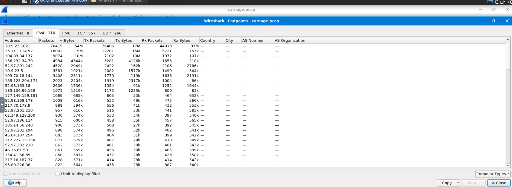

**Victim Internal IP:** 10.9.23.102

### Check DNS Queries (Domain Resolution Before Download)

```sql
dns.flags.response==0
```
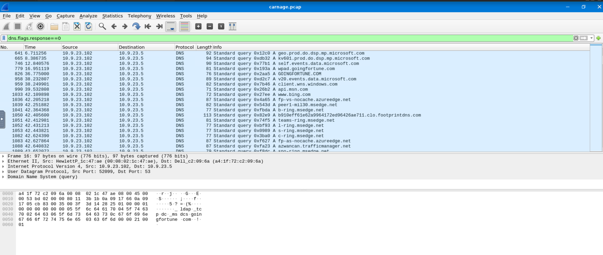

**Observations**

- Total DNS Packets: 381

- No error (Successful queries): 367 (96.33%)

- No such name (NXDOMAIN): 14 (3.67%) ✅

- Unsolicited responses: 0

- Retransmissions: 0

### Look for File Download via HTTP

```sql
http.request
```

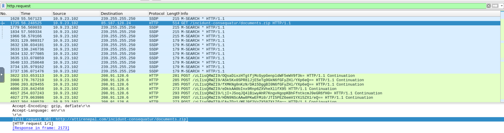

- Right click on any HTTP packet

- Expand Hypertext Transfer Protocol

- Right click Request URI

- Click Apply as Filter → Selected

- Then just modify the extension

```sql
http.request.full_uri == "http://attirenepal.com/incidunt-consequatur/documents.zip"
```

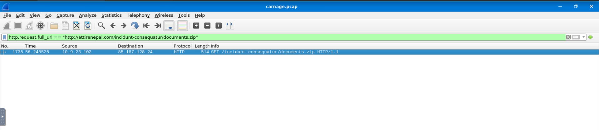

- **Victim Internal IP:** 10.9.23.102  
- **External Server IP:** 85.187.128.24  
- **Domain:** attirenepal.com  
- **Downloaded File:** documents.zip  
- **Protocol:** HTTP  
- **Request Type:** GET  

#### Conclusion

The system 10.9.23.102 downloaded a suspicious ZIP file from an external server, indicating the probable point of compromise.

---

### Check HTTP Response for File Transfer

```sql
http.content_type contains "application"
```

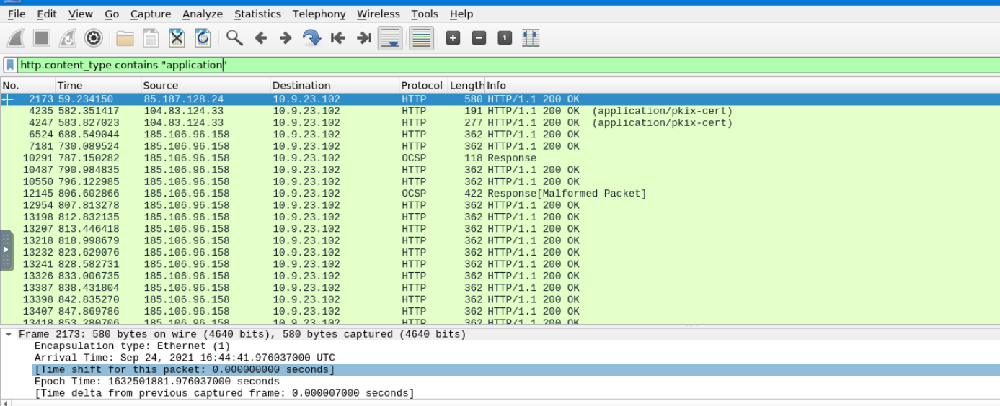

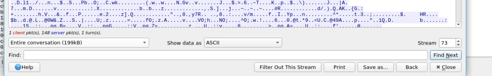

- **Source IP:** 85.187.128.24  
- **Destination (Victim):** 10.9.23.102  
- **HTTP Response:** 200 OK  
- **Content-Type:** application  
- **File Size:** ~198 KB  

 **Analysis**

The external server successfully delivered a file to the victim machine.
The HTTP 200 OK status confirms the download was completed.
The reassembled TCP stream shows a file transfer of approximately 198 KB.

 **Conclusion**

The victim system 10.9.23.102 successfully received a malicious file from 85.187.128.24, confirming the initial compromise stage.

---

### Extract Downloaded File

1 **Go to:**

- File → Export Objects → HTTP

2 Look for: documents.zip

3 Select it → Click Save

4 Save to Desktop or Downloads

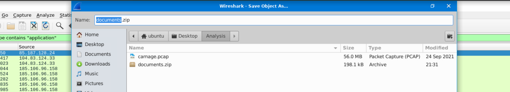

5 Get File Hash:
```sql
sha256sum documents.zip
```
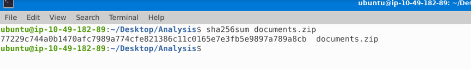

**From VirusTotal:**

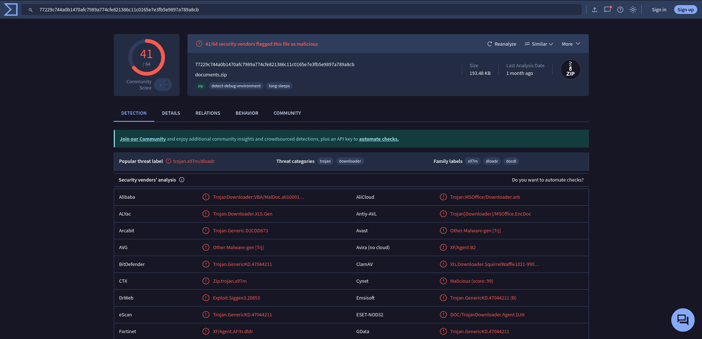


- Detection: 41 / 64 vendors flagged it

- Threat Label: trojan.x97m/dloadr

- Category: Trojan / Downloader

- File Type: ZIP

- Size: ~193 KB

This confirms the ZIP is malicious and likely contains a macro-based downloader.

---

### Check If Downloaded File Contacts C2

```sql
ip.addr == 85.187.128.24
```

shows 0 packets after filtering

**That means:** 85.187.128.24 was ONLY the delivery server
NOT the C2 server

Very common malware behavior:

1 Download from one server
2 Connect to different C2 server after execution

**Filter All External Traffic From Victim**
```sql
ip.src == 10.9.23.102 && !(ip.dst == 10.9.23.0/24)
```
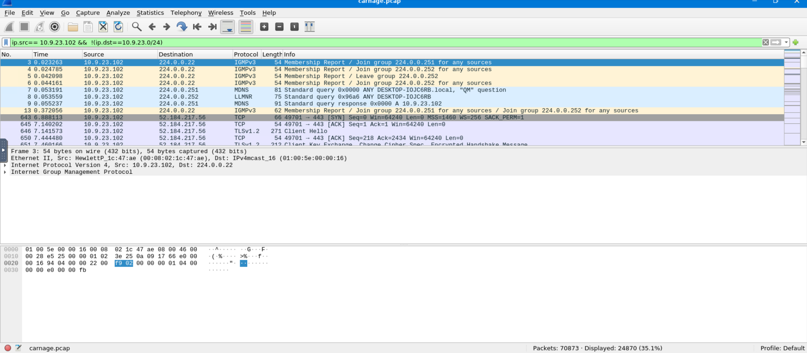

Check for:

```sql
ip.addr == 23.111.114.52
```
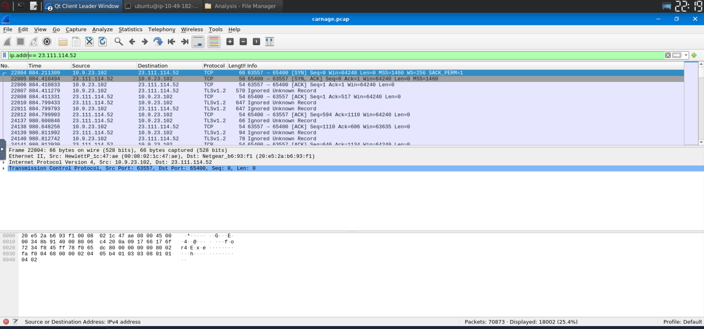

- Protocol: TCP + TLSv1.2

- Port: 65400

- Encrypted traffic

- Large number of packets (18,002)

- Continuous communication

## Command & Control (C2) Communication

After the initial download of documents.zip, the infected host (10.9.23.102) initiated encrypted TLS communication with external IP 23.111.114.52 over TCP port 65400.

The communication consisted of 18,002 packets and was encrypted using TLSv1.2, indicating potential Command & Control activity.

The use of a high uncommon port (65400) and persistent encrypted traffic strongly suggests this IP is the malware C2 server.

---

### Look for Encoded / Suspicious Payload

```sql
http contains "base64"
```

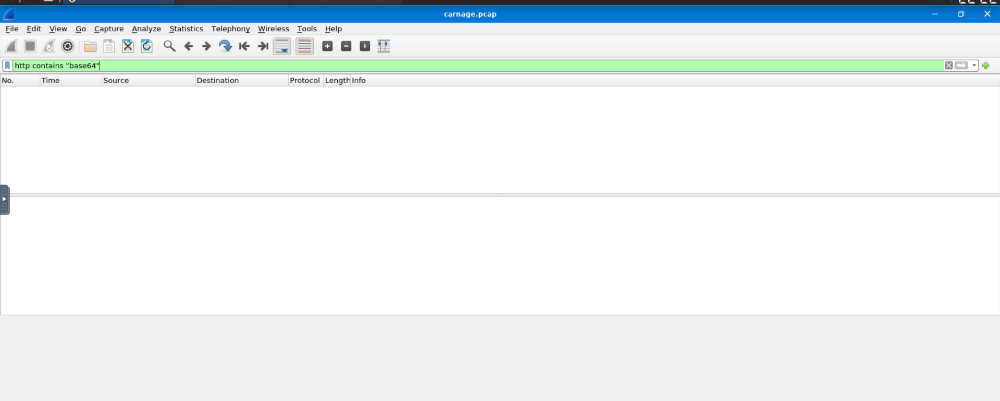

The filter `http contains "base64"` returned 0 results, indicating that no visible Base64-encoded data was transmitted over HTTP.

This is expected because the malware established encrypted TLS communication with the C2 server (23.111.114.52) over port 65400, preventing inspection of the payload contents.


